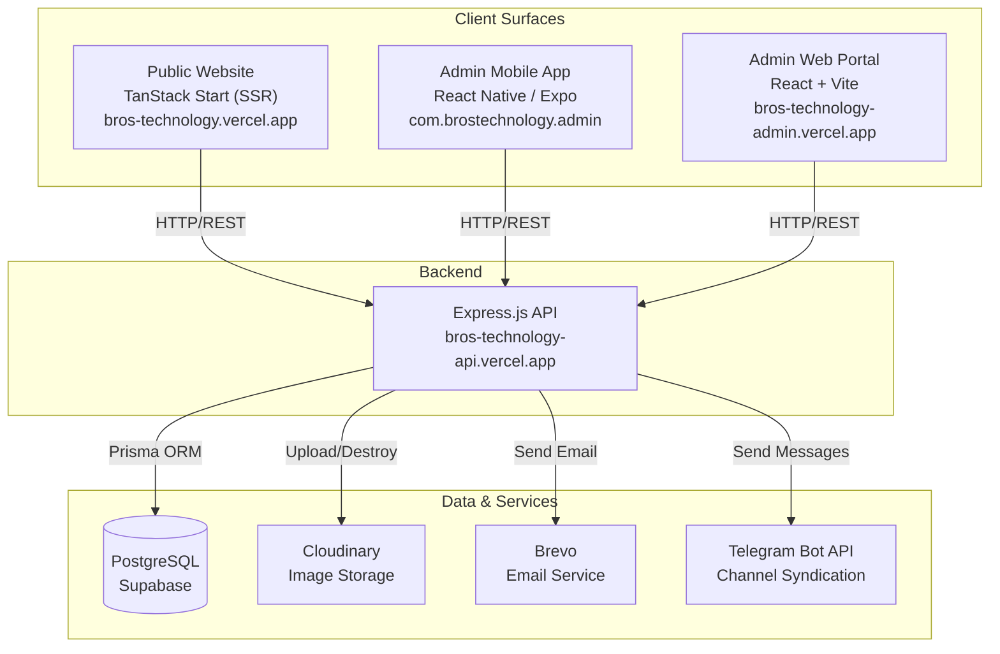

# 00 — System Overview

BROS Technology is an electronics device marketplace for selling iPhones, Samsungs, iPads, MacBooks, Laptops, AirPods, and Smartwatches in Ethiopia. Customers browse a public storefront, inquire about products via Telegram, WhatsApp, or phone call, and a small team of agents and administrators manage the catalog, syndicate products to a Telegram channel, and track assets and commissions — all through a mobile admin app and a web admin portal.

## System Architecture

## Deployed Surfaces

| Surface | URL | Status |
|---------|-----|--------|
| **Backend API** | `https://bros-technology-api.vercel.app` | Production |
| **Public Website** | `https://bros-technology.vercel.app` | Production |
| **Admin Web Portal** | `https://bros-technology-admin.vercel.app` | Production |
| **Admin Mobile App** | `com.brostechnology.admin` (APK / iOS) | Production |

## Tech Stack

| Component | Framework / Language | Key Libraries | Hosting |
|-----------|---------------------|---------------|---------|
| **Backend API** | Node.js + Express 5 (ES modules) | Prisma 6.9, Sharp, Cloudinary, Brevo, JWT, Multer | Vercel (serverless) |
| **Database** | PostgreSQL 15 | Prisma ORM | Supabase (EU-West-3) |
| **Public Website** | React 19 + TanStack Start (SSR) | TanStack Router, React Query, Framer Motion, Three.js, Tailwind CSS v4, shadcn/ui | Vercel (Nitro) |
| **Admin Web Portal** | React 19 + Vite 8 | React Router v7, TanStack Query v5, Recharts, Tailwind CSS v4, Lucide React | Vercel (static SPA) |
| **Admin Mobile App** | React Native 0.85 + Expo SDK 56 | React Navigation, Axios, Expo SecureStore, Expo Notifications, Reanimated | EAS Build (APK/iOS) |
| **Image Processing** | Sharp 0.33 | Resize to 1200px, convert to WebP quality 80 | — |
| **Email** | Brevo (Sendinblue) | Password reset emails with 6-digit code | — |
| **Telegram** | Bot API | Channel posting, inline keyboards, Mini App | — |

## Key Business Rules

- **Inquiry-based commerce**: No cart/checkout. Customers contact the shop directly via Telegram, WhatsApp, or phone call.
- **Dynamic product schema**: Each category defines its own attribute fields (e.g., iPhones need `brand`, `model`, `storage`, `carrier`; Laptops need `processor`, `gpu`, `screenSize`).
- **Agent code system**: New agents register using a 6-digit code generated by the admin. Agents can only see and manage their own listings.
- **Telegram syndication**: Products are posted to a Telegram channel with category-aware captions and inline keyboard buttons for location, browsing, and ordering.
- **Ethiopian market focus**: All prices in ETB (Ethiopian Birr). Product options pre-filled with brands/models popular in Ethiopia.

## Default Credentials

| Email | Password | Role |
|-------|----------|------|
| `admin@brostechnology.com` | `Admin@12345` | SUPER_ADMIN |

> **Warning**: Change this password immediately after first deployment.
